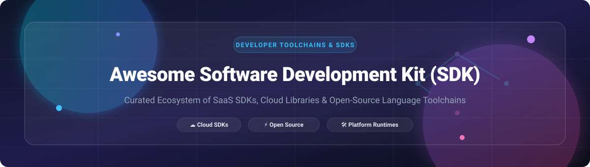

  

  
  
  
  
  
  

---

# 🚀 Awesome Software Development Kit (SDK) Ecosystem

> **A definitive, SEO-optimized curated directory of commercial SaaS SDKs, platform development toolchains, cloud service client libraries, and high-performance open-source SDK frameworks.**

Welcome to the ultimate resource for **Software Development Kits (SDKs)**, API toolchains, and developer platform runtimes. Whether you are building mobile apps (iOS/Android), enterprise cloud infrastructure (AWS/GCP/Azure), cross-platform applications, or AI/ML pipelines, this list provides accurate, up-to-date details on starting tier pricing, free trial limits, enterprise valuations, and GitHub community popularity.

---

## 📋 Table of Contents

- [📊 Sector Overview & Market Analysis](#-sector-overview--market-analysis)
- [💼 Commercial & SaaS Platform SDKs](#-commercial--saas-platform-sdks)
- [⚡ Open-Source GitHub SDKs & Toolchains](#-open-source-github-sdks--toolchains)
  - [🌐 Language & Runtime SDKs](#-language--runtime-sdks)
  - [🤖 AI & Machine Learning SDKs](#-ai--machine-learning-sdks)
  - [☁️ Cloud & Infrastructure Client SDKs](#-cloud--infrastructure-client-sdks)
  - [🛠️ Native Platform & Utility Libraries](#-native-platform--utility-libraries)
- [🤝 How to Contribute](#-how-to-contribute)
- [⚖️ Disclaimer](#-disclaimer)
- [📈 Star History](#-star-history)
- [💖 Support & Community](#-support--community)

---

## 📊 Sector Overview & Market Analysis

The global **Software Development Kit (SDK) and Developer Tools** market is estimated at **~$32.5 Billion** in 2026, exhibiting a compound annual growth rate (CAGR) of **~14.8%**. 

**Market Structure**: The sector is **highly concentrated (winner-take-all dynamics)** among major tech conglomerates (Apple, Microsoft, Alphabet/Google, Amazon) for platform runtimes and cloud infrastructure SDKs. However, specialized sub-domains—such as fintech payments (Stripe) and communications APIs (Twilio)—demonstrate **moderate fragmentation** where agile SaaS providers establish dominant API ecosystems.

---

## 💼 Commercial & SaaS Platform SDKs

> *Ranked by Provider Enterprise Valuation / Market Capitalization (Descending)*

| SaaS Product / SDK | Provider / Owner | Market Cap / Valuation | Starting Tier Pricing | Free Tier Limit / Trial Duration | Primary Focus & Target Use Case |
| :--- | :--- | :--- | :--- | :--- | :--- |
| **[iOS SDK & macOS SDK](https://developer.apple.com/)** | Apple Inc. | **~$3.4 Trillion** | **$99/year** (Apple Developer Program membership required for device signing & App Store distribution) | **Free local dev** in Xcode Simulator; 0 free App Store distribution slots without paid membership | Native iOS, iPadOS, macOS, and watchOS app development using Swift, SwiftUI, and UIKit. |
| **[Windows SDK & Azure SDK](https://developer.microsoft.com/)** | Microsoft Corp. | **~$3.1 Trillion** | **$45/user/month** (VS Pro) / Azure pay-as-you-go starting at **$0.0001** per API call | **Visual Studio Community** is 100% free; Azure includes **$200 free credit** (30 days) + **12 months free** core services (750 B1s VM hrs/mo) | Native Win32/WinRT application SDKs, .NET toolchains, and multi-language Azure cloud client libraries. |
| **[Android SDK & Google Cloud SDK](https://developer.android.com/)** | Alphabet Inc. (Google) | **~$2.1 Trillion** | **$25 one-time fee** (Google Play Console) / GCP pay-as-you-go starting at **$0.0000025** per API request | **Android Studio & SDK** are 100% free for local dev; GCP provides **$300 free credit** (90 days) + **20+ Always Free** services (28 App Engine hrs/day, 2M Cloud Functions calls/mo) | Official Android mobile toolchain (Kotlin/Java) alongside `gcloud` CLI and Google Cloud client libraries. |
| **[AWS SDK](https://aws.amazon.com/developer/tools/)** | Amazon.com Inc. | **~$2.0 Trillion** | Pay-as-you-go starting at **$0.0000002** per AWS Lambda invocation & **$0.023/GB-month** S3 storage | **12 Months Free Tier** (750 EC2 micro hrs/mo, 5GB S3) + **Always Free Tier** (1 Million AWS Lambda invocations/mo) | Multi-language enterprise cloud SDKs covering Amazon Web Services (S3, EC2, DynamoDB, Lambda, Bedrock). |
| **[Stripe SDK](https://stripe.com/docs/sdk)** | Stripe Inc. | **~$70 Billion** | **2.9% + $0.30** per successful transaction (Pay-as-you-go, $0 monthly base subscription) | **Unlimited free sandbox** and test mode API calls with 0 monthly subscription fees | Payment processing, billing subscriptions, and financial infrastructure SDKs across web and mobile. |
| **[Twilio SDK](https://www.twilio.com/docs/libraries)** | Twilio Inc. | **~$11 Billion** | **$0.0079** per SMS sent / **$0.014** per minute for outbound voice calls | **$15.00 free trial credit** provided upon account sign-up (valid for up to 45 days of test calls & SMS) | Programmable voice, SMS, WhatsApp, and omnichannel communications SDKs for web and mobile apps. |

---

## ⚡ Open-Source GitHub SDKs & Toolchains

> *Ranked by GitHub Community Stars_Counts (Descending)*

### 🤖 AI & Machine Learning SDKs

| Open-Source SDK / Repository | GitHub_Stars_Badge | License | Primary Description & Ecosystem Impact |
| :--- | :--- | :--- | :--- |
| **[TensorFlow](https://github.com/tensorflow/tensorflow)** |  | Apache-2.0 | **Google's end-to-end open-source machine learning platform.** Powers ML model training, edge deployment (TensorFlow Lite), and production pipelines across mobile, web, and cloud. |
| **[PyTorch](https://github.com/pytorch/pytorch)** |  | BSD-3-Clause | **Meta's premier open-source deep learning framework.** The industry standard for AI research, dynamic neural networks, LLM training (LLaMA), and computer vision. |
| **[OpenCV](https://github.com/opencv/opencv)** |  | Apache-2.0 | **Open-source real-time computer vision and image processing SDK.** Contains 2500+ optimized algorithms for object detection, facial recognition, and robotics. |

### 🌐 Language & Runtime SDKs

| Open-Source SDK / Repository | GitHub_Stars_Badge | License | Primary Description & Ecosystem Impact |
| :--- | :--- | :--- | :--- |
| **[Flutter SDK](https://github.com/flutter/flutter)** |  | BSD-3-Clause | **Google's UI toolkit for multi-platform compilation.** Build high-performance, natively compiled mobile (iOS/Android), web, and desktop apps from a single Dart codebase. |
| **[Go SDK](https://github.com/golang/go)** |  | BSD-3-Clause | **The Go programming language toolchain and standard library.** Built for extreme concurrency and microservice speed. Powers cloud-native foundations like Docker and Kubernetes. |
| **[React Native SDK](https://github.com/facebook/react-native)** |  | MIT | **Meta's cross-platform native app framework.** Build native Android and iOS applications using React and JavaScript/TypeScript. |
| **[Node.js SDK](https://github.com/nodejs/node)** |  | MIT | **Server-side JavaScript runtime built on Chrome's V8 engine.** The foundation for modern backend web SDKs and the 2M+ package npm ecosystem. |
| **[TypeScript SDK](https://github.com/microsoft/TypeScript)** |  | Apache-2.0 | **Microsoft's typed superset of JavaScript.** Provides static typing, compile-time verification, and modern tooling for large-scale enterprise web applications. |
| **[Rust Language SDK](https://github.com/rust-lang/rust)** |  | MIT / Apache-2.0 | **Empowering everyone to build reliable and efficient software.** Memory-safe systems programming language compiler, standard library, and core toolchain. |
| **[Godot Engine SDK](https://github.com/godotengine/godot)** |  | MIT | **Free, open-source 2D and 3D game engine SDK.** Fully featured cross-platform editor with C#, GDScript, and C++ bindings. |
| **[Swift SDK](https://github.com/apple/swift)** |  | Apache-2.0 | **Apple's fast, modern, and safe programming language.** Open-source toolchain for iOS, macOS, Linux, and Windows development. |
| **[Python SDK (CPython)](https://github.com/python/cpython)** |  | PSF | **The reference C implementation of Python.** Powers data science, artificial intelligence, scripting, web services, and automation worldwide. |
| **[Kotlin SDK](https://github.com/JetBrains/kotlin)** |  | Apache-2.0 | **JetBrains' modern multiplatform language.** Google's preferred programming language for Android app development, JVM backends, and Kotlin Multiplatform (KMP). |
| **[OpenJDK](https://github.com/openjdk/jdk)** |  | GPL-2.0 w/ Classpath | **The open-source reference implementation of the Java Platform, SE.** Foundation for enterprise microservices, Android runtimes, and big data systems. |
| **[.NET Runtime & SDK](https://github.com/dotnet/runtime)** |  | MIT | **Microsoft's cross-platform .NET runtime, garbage collector, and core libraries.** Powers ASP.NET Core, Blazor, and .NET MAUI. |
| **[Rustup Toolchain](https://github.com/rust-lang/rustup)** |  | MIT / Apache-2.0 | **The official Rust toolchain installer and version manager.** Seamlessly manages `rustc`, `cargo`, `clippy`, and cross-compilation targets. |
| **[Dart SDK](https://github.com/dart-lang/sdk)** |  | BSD-3-Clause | **Client-optimized language SDK powering Flutter.** Features sound null safety, AOT/JIT compilation, and asynchronous streams. |
| **[.NET SDK CLI](https://github.com/dotnet/sdk)** |  | MIT | **The command-line tools for building .NET applications.** Includes `dotnet` CLI compiler orchestration, project templates, and NuGet integration. |

### ☁️ Cloud & Infrastructure Client SDKs

| Open-Source SDK / Repository | GitHub_Stars_Badge | License | Primary Description & Ecosystem Impact |
| :--- | :--- | :--- | :--- |
| **[Supabase SDK](https://github.com/supabase/supabase)** |  | Apache-2.0 | **The open-source Firebase alternative.** Complete client SDK suite for PostgreSQL database subscription, authentication, storage, and edge functions. |
| **[AWS SDK for Python (Boto3)](https://github.com/boto/boto3)** |  | Apache-2.0 | **Official Python SDK for AWS services.** Enables seamless integration with Amazon S3, EC2, DynamoDB, Bedrock, and IAM in Python scripts. |
| **[AWS SDK for JS v3](https://github.com/aws/aws-sdk-js-v3)** |  | Apache-2.0 | **Modular AWS SDK for JavaScript and TypeScript.** Zero-dependency modular architecture designed for minimal bundle sizes in Node.js and browser apps. |

### 🛠️ Native Platform & Utility Libraries

| Open-Source SDK / Repository | GitHub_Stars_Badge | License | Primary Description & Ecosystem Impact |
| :--- | :--- | :--- | :--- |
| **[FFmpeg SDK](https://github.com/ffmpeg/ffmpeg)** |  | LGPL / GPL | **Universal multimedia framework SDK.** Complete C libraries (`libavcodec`, `libavformat`) for video/audio encoding, decoding, transcoding, and streaming. |

---

## 🤝 How to Contribute

We welcome contributions from software engineers, platform architects, and open-source maintainers!

1. **Fork** this repository.
2. Create a feature branch (`git checkout -b add-awesome-sdk`).
3. Add or update entries in `README.md` keeping formatting consistent:
   - Provide exact starting tier pricing (no generic terms like 'Usage-based').
   - Provide exact free tier limits or free trial durations.
   - Attach a social-style Stars_Badge linking to the repo's `/stargazers` page.
4. Submit a **Pull Request** with a concise description of your changes.

Check out [Awesome-Awesome-Awesome](https://github.com/ishandutta2007/Awesome-Awesome-Awesome) for more curated developer lists.

---

## ⚖️ Disclaimer

- This list is **community-curated** for informational purposes and does not constitute commercial endorsement.
- SDKs interact deeply with operating systems and cloud APIs. Always inspect official security advisories and licensing agreements before deploying third-party SDKs to production environments.
- Enterprise SLAs, security compliance (SOC2/ISO), and dedicated technical support remain primarily under paid commercial vendor agreements.

---

## 📈 Star History

---

## 💖 Support & Community

Thank you for exploring the **Awesome Software Development Kit (SDK)** repository! If you find this curated collection helpful for your software projects or platform architecture:

- ⭐ **Star** this repository to stay updated with new SDK releases.
- 🔀 **Fork** it to keep a copy and contribute your own discoveries.
- 📢 **Share** it with fellow software engineers, platform architects, and developers.

If you'd like to support the ongoing maintenance and curation of open-source developer resources:

---

  <i>Built with ❤️ for developers, platform engineers, and software architects worldwide.</i>

